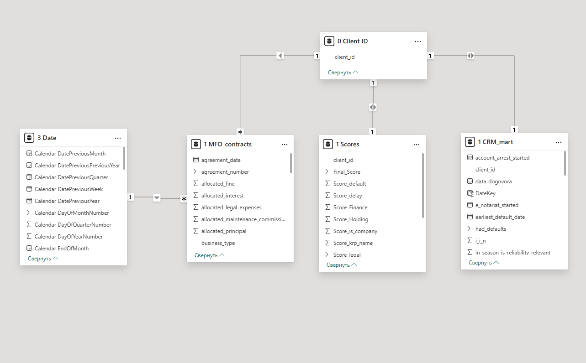
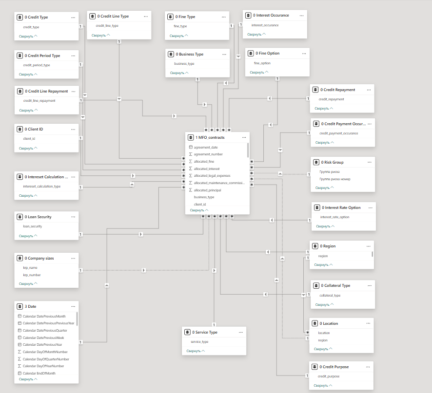
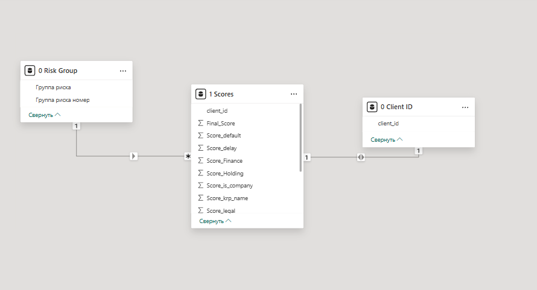
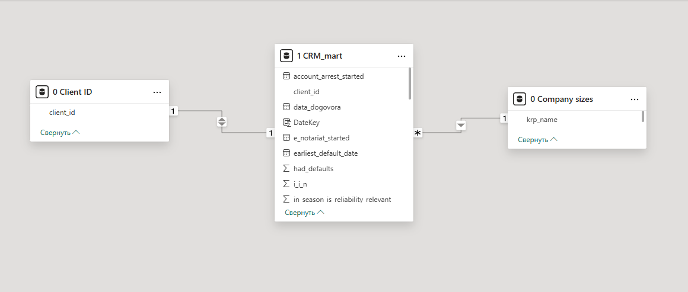
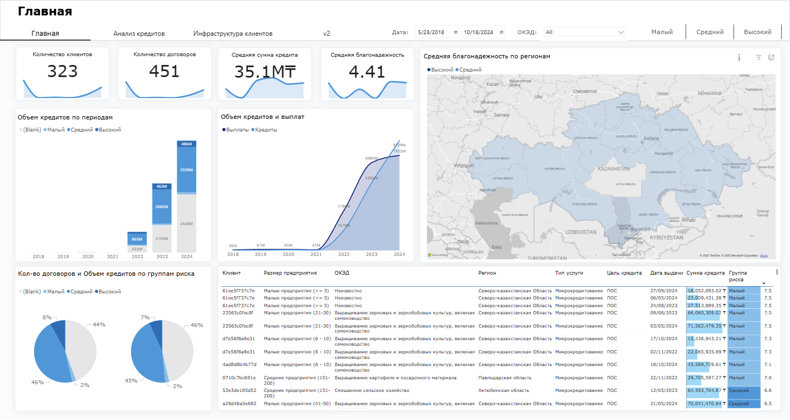
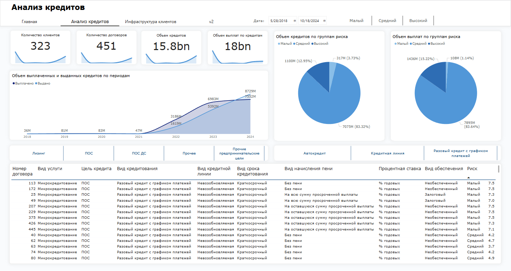
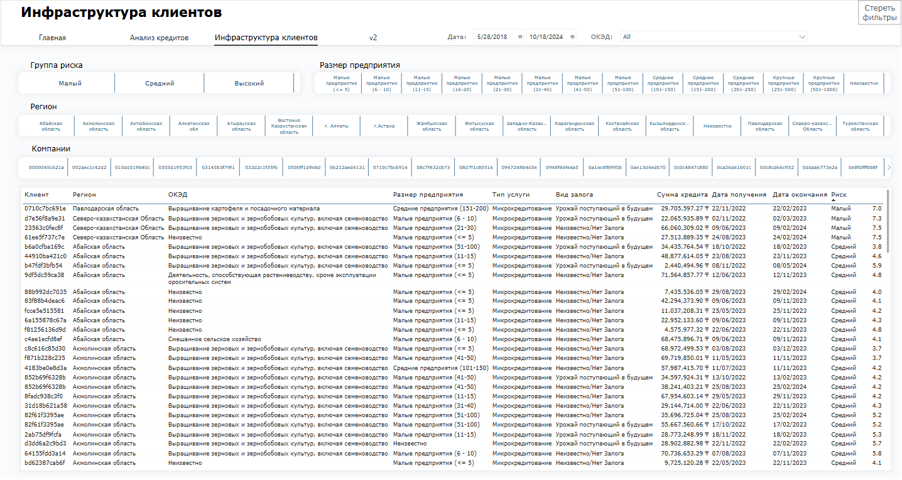
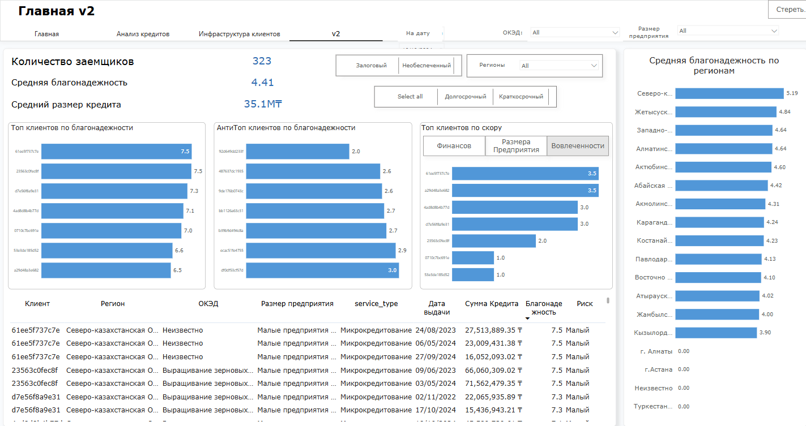

# **Документация по расчету скоринга благонадежности клиентов**

Цель – рассчитать **финальный скоринговый балл** клиента, основываясь на **его финансовой дисциплине, размере компании и вовлеченности в холдинг**.

**ВАЖНО**: ОТЧЕТ СДЕЛАН НА ОСНОВАНИИ ДАННЫХ ТОЛЬКО О КЛИЕНТАХ ИЗ MFO_CONTRACTS

Можно было ограничиться использованием Power BI, но так как позиция подразумевала владение Python и для разнообразия я производил расчеты в Python😁

----------

## **Извлечение данных из базы данных**
-   `crm_mart` – данные о клиентах, их платежной дисциплине, долгах и арестах.
-   `mfo_contracts` – данные о договорах микрофинансирования.

Для получения **актуальных данных**, мы выбираем **самые свежие записи по каждому клиенту** (сортировка по `season_id`).

```python
db_params = {
    "dbname": "contest_pit",
    "user": "challenger",
    "password": "...",
    "host": "18.192.187.252",
    "port": 8080
}

try:
    conn = psycopg2.connect(**db_params)
    print("Успешное подключение к базе данных")

    # Чтение данных из таблиц в DataFrame
    query_mfo_contracts = "SELECT * FROM bi_developer.mfo_contracts WHERE client_id NOT IN ('aff6769cdde2', '6d4e2c039b16', '651434853cc7')"
    query_crm_mart = '''
                    WITH MaxSeason AS (
                    SELECT 
                        client_id,
                        MAX(season_id) AS max_season_id
                    FROM bi_developer.crm_mart
                    WHERE client_id IN (SELECT DISTINCT client_id FROM bi_developer.mfo_contracts WHERE client_id NOT IN ('aff6769cdde2', '6d4e2c039b16', '651434853cc7'))
                    GROUP BY client_id
                )
                SELECT cm.*
                FROM bi_developer.crm_mart cm
                JOIN MaxSeason ms ON cm.client_id = ms.client_id AND cm.season_id = ms.max_season_id;
                    '''
	mfo_contracts = pd.read_sql(query_mfo_contracts, conn)
    crm_mart = pd.read_sql(query_crm_mart, conn)
"""
```
В mfo_contracts есть 3 клиента с ошибочно введенными данными, для избегания проблем в будущем используется следующее условие:
```sql
WHERE client_id NOT IN ('aff6769cdde2', '6d4e2c039b16', '651434853cc7')
```
\
Данные были вытянуты без использования разворачивания legal_status в запросе, исключительно с целью усложнения для интереса, однако можно было вытянуть данные с разворачиванием legal_status, таким образом:
``` sql
SELECT 
    *,legal_status->>'krp_name' AS krp_name,
    legal_status->>'is_e_notariat' AS is_e_notariat,
    legal_status->>'is_travel_ban' AS is_travel_ban,
    legal_status->>'is_account_arrest' AS is_account_arrest,
    legal_status->>'e_notariat_started' AS e_notariat_started,
    legal_status->>'is_property_arrest' AS is_property_arrest,
    legal_status->>'travel_ban_started' AS travel_ban_started,
    legal_status->>'is_arrest_transport' AS is_arrest_transport,
    legal_status->>'is_registration_ban' AS is_registration_ban,
    legal_status->>'account_arrest_started' AS account_arrest_started,
    legal_status->>'property_arrest_started' AS property_arrest_started,
    legal_status->>'registration_ban_started' AS registration_ban_started,
    legal_status->>'transport_arrest_started' AS transport_arrest_started
FROM bi_developer.crm_mart
```

## **Чистка данных**
Удаляем пустые колонки   
``` python
mfo_contracts = mfo_contracts.drop(['unnamed_38', 'unnamed_39'], axis=1)
```
\
В датасете данные колонки содержат числовые данные, но хранятся как текстовые и содержат разделители:
1.  allocated_interest
2.  credit_sum
3.  interest_sum
4.  paid_total
5.  allocated_principal
6.  collateral_value
7.  down_payment_sum
8.  allocated_fine
9.  allocated_legal_expenses

Для устранения проблемы используем функцию:
``` python
def clean_numeric_columns(df, columns):
    """
    Convert specified columns in a DataFrame to strings and remove commas.
    
    :param df: pd.DataFrame - The DataFrame to process
    :param columns: list - List of column names to clean
    """
    for col in columns:
        df[col] = df[col].astype(str).str.replace(',', '', regex=True)  
```
``` python
columns_to_remove_commas = ['allocated_interest', 'credit_sum', 'interest_sum', 
                    'paid_total', 'allocated_principal', 'collateral_value', 
                    'down_payment_sum', 'allocated_fine', 'allocated_legal_expenses']

clean_numeric_columns(mfo_contracts, columns_to_remove_commas)      
```
\
Далее классифицируем колонки по типам данных:
 ``` python
# Группируем колонки по типам
object_cols = [
    'client_id', 'region', 'location', 'business_type', 'service_type',
    'credit_line_repayment', 'credit_type', 'credit_period_type',
    'credit_line_type', 'credit_repayment', 'credit_purpose',
    'credit_payment_occurance', 'intereset_calculation_type',
    'interest_rate_option', 'interest_occurance', 'fine_type',
    'fine_option', 'collateral_type', 'loan_security'
]

date_cols = ['agreement_date', 'credit_issue_date', 'last_payment']

float_cols = [
    'credit_period', 'interest_rate', 'effective_rate', 'collateral_value',
    'down_payment_rate', 'down_payment_sum', 'gesv_sum', 'credit_sum',
    'interest_sum', 'paid_total', 'allocated_principal',
    'allocated_interest', 'allocated_fine', 'allocated_legal_expenses',
    'allocated_maintenance_commission'
]

int_cols = ['agreement_number']
``` 

## Чистка crm_mart:
Разворачиваем колонку legal_status, затем удаляем ее.
``` python
legal_status_expanded = pd.json_normalize(crm_mart['legal_status'])
crm_mart = crm_mart.drop(columns=['legal_status']).join(legal_status_expanded)
```
Переходим к типам данных колонок, создаем списки для хранения названий колонок в одинаковыми типами :
``` python
# Листы содержат колонки для определенных типов данных
crm_mart_datetime = ['account_arrest_started', 'data_dogovora', 'e_notariat_started', 'earliest_default_date', 'property_arrest_started', 'registration_ban_started', 'transport_arrest_started', 'travel_ban_started']
crm_mart_float = ['i_i_n', 'max_delayed_days', 'oplacheno_pri_kontrolinge', 'oplacheno_pri_sudakh', 'season_id', 'summa_dogogvora', 'summa_elevator', 'summa_oplacheno', 'summa_otgruzheno', 'summa_vozvrat', 'summa_zakupa_trading', 'is_delay_90', 'sku_category_count', 'year', 'had_defaults', 'in_season_is_reliability_relevant', 'is_account_arrest', 'is_arrest_transport', 'is_company', 'is_e_notariat', 'is_property_arrest', 'is_recon', 'is_registration_ban', 'is_travel_ban', 'last_is_reliability_relevant', 'type_clinet_elevatora', 'type_popodal_na_kontroling', 'type_postavshik_zerna', 'type_sudimsa']
crm_mart_int = ['i_i_n','is_delay_90', 'sku_category_count', 'year', 'had_defaults', 'in_season_is_reliability_relevant', 'is_account_arrest', 'is_arrest_transport', 'is_company', 'is_e_notariat', 'is_property_arrest', 'is_recon', 'is_registration_ban', 'is_travel_ban', 'last_is_reliability_relevant', 'type_clinet_elevatora', 'type_popodal_na_kontroling', 'type_postavshik_zerna', 'type_sudimsa']
crm_mart_object = ['client_id', 'krp_name']
```

Для начала заменяем текстовые значения, в числовых колонках ('true', 'false' и т.д.)
``` python
# Заменяем true/false значения числовыми эквивалентами для дальнейшего удобства
for column in crm_mart_float:
    crm_mart[column] = crm_mart[column].astype(str).replace({
    'True': 1, 'False': 0, 'nan': 0, 'None': 0, None: 0
    })
```
Убираем запятые из float колонок, ранее созданной функцией.
``` python
clean_numeric_columns(crm_mart, crm_mart_float)
```
Придаем типа данных.
``` python
crm_mart[crm_mart_datetime] = crm_mart[crm_mart_datetime].astype('datetime64[ns]')
crm_mart[crm_mart_float] = crm_mart[crm_mart_float].astype('float64')
crm_mart[crm_mart_object] = crm_mart[crm_mart_object].astype('object')
crm_mart[crm_mart_int] = crm_mart[crm_mart_int].astype('int64')
```
\
На этом чистка данных завершена😁

## **Расчет скоринговых баллов**
Хотя формулы и учитывают, то что баллы должны находиться в **определенном диапазоне**, в целях предосторожности мы использовали **`.clip(min, max)`**, чтобы гарантировать, что значения **не выходят за пределы [min,max]**.

### **Формулы скоринга:**

1.  **Отсутствие арестов , судимости и задолженности (Финансовый скоринг) (макс. 4 балла)**
    
    -   Просрочки:
    $Score_{delay} = \max(0, 1 - \frac{max\_delayed\_days}{365})$
    
    -   Банкротства:
    $Score_{default} = 1 - had\_defaults$
    
    -   Налоговые задолженности:
$Score_{tax} = \max(0, 1 - (last\_is\_reliability\_relevant \times 0.6 + in\_season\_is\_reliability\_relevant \times 0.4))$
    
    -   Аресты и суды:
    $Score_{legal} = 1 - (\text{Количество арестов} \times 0.125)$
    
    - **Финансовый скоринг**
    $Score_{finance} = Score_{delay} \times 0.3 + Score_{default} \times 0.2 + Score_{tax} \times 0.3 + Score_{legal} \times 0.2$
    
    Код:
```python
crm_mart_filtered["Score_delay"] = (1 - crm_mart_filtered["max_delayed_days"] / 365).clip(0, 1)
crm_mart_filtered["Score_default"] = 1 - crm_mart_filtered["had_defaults"]
crm_mart_filtered["Score_tax"] = (1 - (crm_mart_filtered["last_is_reliability_relevant"] * 0.6 +
                                       crm_mart_filtered["in_season_is_reliability_relevant"] * 0.4)).clip(0, 1)
legal_columns = ["type_sudimsa", "type_popodal_na_kontroling", "is_account_arrest", ...]
crm_mart_filtered["Score_legal"] = (1 - (crm_mart_filtered[legal_columns].sum(axis=1) * 0.125)).clip(0, 1)

# Итоговый Score_finance
crm_mart_filled["Score_finance"] = (
    crm_mart_filled["Score_delay"] * 0.3 +
    crm_mart_filled["Score_default"] * 0.2 +
    crm_mart_filled["Score_tax"] * 0.3 +
    crm_mart_filled["Score_legal"] * 0.2
).clip(0, 1)
```

2.  **Размер предприятия (макс. 2 балла)**
    
    -   Проверка на юридическое лицо:
   $$
Score_{is\_company} = (is\_company \times 0.5) + \begin{cases} 
1, & \text{if } i\_i\_n = 0 \ (Если \ ИИН \ отсутствует)\\
0, & \text{otherwise}
\end{cases}
$$
    -   Оценка размера предприятия:
   $$
Score_{krp\_name} = \begin{cases} 
0, & \text{если бизнес малый} \\ 
0.5, & \text{если бизнес средний} \\ 
1.0, & \text{если бизнес крупный} 
\end{cases}
$$
    - **Скоринг размера предприятия**
    $Score_{size} = (Score_{is\_company} \times 0.5) + (Score_{krp\_name} \times 0.5)$

Код:
```python
# Юридическое лицо (0 - физ.лицо, 0.1 - юр.лицо)
crm_mart_filled["Score_is_company"] = crm_mart_filled["is_company"]*0.5 + crm_mart_filled["i_i_n"].apply(lambda x: 1 if x == 0 else 0.5) # смотрим на оба признака юр. или  физ.лица

# Оценка по размеру предприятия
crm_mart_filled["Score_krp_name"] = crm_mart_filled["krp_name"].apply(
    lambda x: 0 if "Малые" in str(x) else (0.5 if "Средние" in str(x) else 1.0)
)

# Итоговый Score_size
crm_mart_filled["Score_size"] = (crm_mart_filled["Score_is_company"] * 0.5 + 
                                 crm_mart_filled["Score_krp_name"] * 0.5).clip(0, 1)

```

3.  **Вовлеченность клиента в услуги всего холдинга (макс. 4 балла)**
    
    -   Тип сотрудничества:
   $Score_{partnership} = type\_postavshik\_zerna \times 0.5 + type\_clinet\_elevatora \times 0.5$
   
    -   Разнообразие покупо:
    $Score_{sku} = \frac{sku\_category\_count}{\max(sku\_category\_count)}$
   Нормализировано по максимальному кол-ву категорий товаров в корзине, однако можно изменить при желании 	заказчика
   
    - **Скоринг вовлеченности**
    $Score_{holding} = (Score_{partnership} \times 0.5) + (Score_{sku} \times 0.5)$

Код:
```python
# Тип сотрудничества (0 или 1, если клиент пользуется услугами холдинга)
crm_mart_filled["Score_partnership"] = (crm_mart_filled["type_postavshik_zerna"] + 
                                        crm_mart_filled["type_clinet_elevatora"]).clip(0, 1)

# Разнообразие покупок (нормализация количества категорий товаров)
max_sku_category = crm_mart_filled["sku_category_count"].max() if crm_mart_filled["sku_category_count"].max() > 0 else 1
crm_mart_filled["Score_sku"] = (crm_mart_filled["sku_category_count"] / max_sku_category).clip(0, 1)

# Итоговый Score_holding
crm_mart_filled["Score_holding"] = (crm_mart_filled["Score_partnership"] * 0.5 + 
                                    crm_mart_filled["Score_sku"] * 0.5).clip(0, 1)
```
### Скоринг благонадежности
$Final\_Score = (Score_{finance} \times 4) + (Score_{size} \times 2) + (Score_{holding} \times 4)$

```python
crm_mart_filtered["Final_Score"] = (
    crm_mart_filtered["Score_finance"] * 4 +
    crm_mart_filtered["Score_size"] * 2 +
    crm_mart_filtered["Score_holding"] * 4
).clip(0, 10)
```

----------

## **Power BI**
В Power BI мы грузим 3 таблицы:
1.  mfo_contracts
2. crm_mart
3. Scores

Scores содержит в себе client_id и все скоры которые мы высчитали.

### **Power query**
В Power query:
1. Придаем типы данных в таблицах
2. В Scores таблицу мы добавляем условный столбец:
$$
Группа \ риска = \begin{cases} 
Final\_score < 3.33, & \text{3 (Высокий)} \\ 
Final\_score < 6.67, & \text{2 (Средний)} \\ 
else, & \text{1 (Малый)} 
\end{cases}
$$
```M
= Table.AddColumn(#"Измененный тип", "Группа риска", each if [Final_Score] < 3.33 then 3 else if [Final_Score] < 6.67 then 2 else 1)
```
3.  Заменяем пустые значения в колонках mfo_contracts: region, location, business_type, collateral_type
```M
#"Замененное значение" = Table.ReplaceValue(#"Округлено вниз",null,"Неизвестно",Replacer.ReplaceValue,{"region"}),
#"Замененное значение1" = Table.ReplaceValue(#"Замененное значение",null,"Неизвестно",Replacer.ReplaceValue,{"location", "business_type"}),
#"Замененное значение3" = Table.ReplaceValue(#"Замененное значение1",null,"Неизвестно/Нет Залога",Replacer.ReplaceValue,{"collateral_type"})
```
4. Создаем справочники из атрибутов из таблицы mfo_contracts:
	- Client ID, Region, Location, Business Type, Service Type, Credit Line Repayment, Credit Type, Credit Period Type,  Credit Line Type, Credit Repayment, Credit Purpose, Credit Payment Occurance, Intereset Calculation Type, Interest Rate Option, Interest Occurance, Fine Type, Fine Option, Collateral Type, Loan Security, Company sizes
5. Создаем справочник Risk Group:

| Группа риска номер | Группа риска |
|--------------------|-------------|
| 2                 | Средний      |
| 3                 | Высокий      |
| 1                 | Малый        |


6. Переименовываем таблицы в формате:
	- "0 Название_справочника"
	-  "1 Название_факт_таблицы"

### **Создаем календарь**
Возможно выглядит сложным, однако тут есть все что может пригодиться при будущих изменениях. Календарь на века так сказать😄
```DAX
3 Date =
VAR  FirstYear = YEAR(MIN('1 MFO_contracts'[agreement_date]))
VAR  LastYear = YEAR(MAX('1 MFO_contracts'[agreement_date]))
VAR  FirstDayCalendar = MIN('1 MFO_contracts'[agreement_date])
VAR  LastDayCalendar = MAX('1 MFO_contracts'[agreement_date])
VAR  RawDays = CALENDAR(FirstDayCalendar, LastDayCalendar)
VAR  CompleteCalendar =
ADDCOLUMNS(
RawDays,
"Dates", [Date],
"DateKey", YEAR([Date]) * 10000 + MONTH([Date]) * 100 + DAY([Date]),
"Day of Month", DAY([Date]),
"WeekDayNumber", WEEKDAY([Date], 2),
"Week Day", FORMAT([Date], "ddd"),
"Sequential365DayNumber", DATEDIFF(FirstDayCalendar, [Date], DAY) + 1,
"Calendar YearNumber", YEAR([Date]),
"Calendar Year", FORMAT([Date], "YYYY"),
"Calendar QuarterNumber", INT((MONTH([Date]) - 1) / 3) + 1,
"Calendar Quarter", "Кв." & FORMAT(INT((MONTH([Date]) - 1) / 3) + 1, "0"),
"Calendar YearQuarterNumber", YEAR([Date]) * 10 + INT((MONTH([Date]) - 1) / 3) + 1,
"Calendar Quarter Year", "Кв." & FORMAT(INT((MONTH([Date]) - 1) / 3) + 1, "0") & " " & FORMAT([Date], "YYYY"),
"Calendar MonthNumber", MONTH([Date]),
"Calendar Month", FORMAT([Date], "MMMM"),
"Calendar YearMonthNumber", YEAR([Date]) * 100 + MONTH([Date]),
"Calendar Month Year", FORMAT([Date], "MMMM YYYY"),
"Calendar WeekNumber", WEEKNUM([Date], 2),
"Calendar Week", "Нед. " & FORMAT(WEEKNUM([Date], 2), "00"),
"Calendar YearWeekNumber", YEAR([Date]) * 100 + WEEKNUM([Date], 2),
"Calendar Week Year", "Нед. " & FORMAT(WEEKNUM([Date], 2), "00") & " " & FORMAT([Date], "YYYY"),
"Calendar WeekYearOrder", YEAR([Date]) * 100 + WEEKNUM([Date], 2),
"Calendar StartOfWeek", [Date] - WEEKDAY([Date], 2) + 1,
"Calendar EndOfWeek", [Date] - WEEKDAY([Date], 2) + 7,
"Calendar StartOfMonth", EOMONTH([Date], -1) + 1,
"Calendar EndOfMonth", EOMONTH([Date], 0),
"Calendar StartOfQuarter", DATE(YEAR([Date]), ((INT((MONTH([Date]) - 1) / 3) * 3) + 1), 1),
"Calendar EndOfQuarter", EOMONTH(DATE(YEAR([Date]), ((INT((MONTH([Date]) - 1) / 3) * 3) + 1), 1), 2),
"Calendar StartOfYear", DATE(YEAR([Date]), 1, 1),
"Calendar EndOfYear", DATE(YEAR([Date]), 12, 31),
"Calendar MonthDays", DAY(EOMONTH([Date], 0)),
"Calendar QuarterDays", DATEDIFF(DATE(YEAR([Date]), ((INT((MONTH([Date]) - 1) / 3) * 3) + 1), 1), EOMONTH(DATE(YEAR([Date]), ((INT((MONTH([Date]) - 1) / 3) * 3) + 1), 1), 2), DAY),
"Calendar YearDays", DATEDIFF(DATE(YEAR([Date]), 1, 1), DATE(YEAR([Date]), 12, 31), DAY) + 1,
"Calendar DayOfMonthNumber", DAY([Date]),
"Calendar DayOfQuarterNumber", DATEDIFF(DATE(YEAR([Date]), ((INT((MONTH([Date]) - 1) / 3) * 3) + 1), 1), [Date], DAY) + 1,
"Calendar DayOfYearNumber", DATEDIFF(DATE(YEAR([Date]), 1, 1), [Date], DAY) + 1,
"Calendar DatePreviousWeek", [Date] - 7,
"Calendar DatePreviousMonth", EOMONTH([Date], -1),
"Calendar DatePreviousQuarter", DATE(YEAR([Date]), ((INT((MONTH([Date]) - 1) / 3) * 3) - 2), 1),
"Calendar DatePreviousYear", DATE(YEAR([Date]) - 1, MONTH([Date]), DAY([Date])),
"Calendar DatePreviousPreviousYear", DATE(YEAR([Date]) - 2, MONTH([Date]), DAY([Date])),
"IsWorkingDay", IF(WEEKDAY([Date], 2) <= 5, TRUE(), FALSE()),
"Day Type", IF(WEEKDAY([Date], 2) <= 5, "Рабочий день", "Выходной")
)
RETURN  CompleteCalendar
```
### **Выстраиваем модель данных**
Опять таки на первый взгляд сложно, однако сделано для будущего удобства. 

Модель основных таблиц:


Модель mfo_contracts (все атрибуты были распределены в отдельные таблицы):


Модель Scores:
\


Модель crm_mart:


### **DAX Меры**
Все меры:
```dax
Количество договоров =
VAR  result = COUNT('1 MFO_contracts'[client_id])
RETURN  IF(ISBLANK(result), 0, result)
```
```dax
Количество заемщиков =
VAR  result = DISTINCTCOUNT('1 MFO_contracts'[client_id])
RETURN  IF(ISBLANK(result), 0, result)
```
\
В таблице **'1 MFO_contracts'** клиенты повторяются, а в **'1 Scores'**  клиенты уникальные, просто вычислить средний скор через **AVERAGE()** и затем визуализировать его с датами не получится, так как  **'1 Scores'** не имеет колонок с датами. Для этого мы вычисляем средний скор среди уникальных клиентов**, учитывая, что оценки хранятся в **"1 Scores"**, а фильтрация идет через связь с **'1 MFO_contracts'**. 
```dax
Средний размер скор =
	AVERAGEX(
		SUMMARIZE(
			'1 MFO_contracts',
			'1 MFO_contracts'[client_id],
			"Score_Size", MAX('1 Scores'[Score_Size])
	),
	[Score_Size]
)
```
```dax
Средний фин. скор =
	AVERAGEX(
		SUMMARIZE(
			'1 MFO_contracts',
			'1 MFO_contracts'[client_id],
			"Score_Finance", MAX('1 Scores'[Score_Finance])
	),
	[Score_Finance]
)
```
```dax
Средняя вовлеченность =
	AVERAGEX(
		SUMMARIZE(
			'1 MFO_contracts',
			'1 MFO_contracts'[client_id],
			"Score_Holding", MAX('1 Scores'[Score_Holding])
	),
	[Score_Holding]
)
```
```dax
Средняя благонадежность =
	AVERAGEX(
		SUMMARIZE(
			'1 MFO_contracts',
			'1 MFO_contracts'[client_id],
			"FinalScore", MAX('1 Scores'[FinalScore])
	),
	[FinalScore]
)
```
\
```M
Средняя сумма кредита =
VAR  result = AVERAGE('1 MFO_contracts'[credit_sum])
RETURN  IF(ISBLANK(result), 0, result)
```
```M
Сумма выплачено =
VAR  allocated_principal = SUM('1 MFO_contracts'[allocated_principal])
VAR  allocated_interest = SUM('1 MFO_contracts'[allocated_interest])
VAR  result = allocated_principal + allocated_interest
RETURN  IF(ISBLANK(result), 0, result)
```
```M
Сумма кредитов =
VAR  result = SUM('1 MFO_contracts'[credit_sum])
RETURN  IF(ISBLANK(result), 0, result)
```

### **Визуализации**
Карточки:
1. Кол-во клиентов
2. Кол-во договоров
3. Средняя сумма кредита
4. Средняя благонадежность
5. Объем кредитов
6. Объем выплат по кредитам

Срезы:
1. Группа риска
2. ОКЭД
3. Дата
4. Размер предприятия
5. Цель кредита
6. Тип кредита
7. Регион
8. Клиент
9. Вид обеспечения кредита
10. Вид срока кредитования

**Главная**:

1. Объем кредитов по периодам
2. Объем кредитов и выплат
3. Кол-во договоров и Объем кредитов по группам риска
4.  Средняя благонадежность по регионам (карта)

**Анализ кредитов**:

1. Объем выплаченных и выданных кредитов по периодам
2. Объем кредитов по группам риска
3. Объем выплат по группам риска

**Инфраструктура клиентов**:


**v2** (таблица не входит в основной отчет, просто эксперимент с дизайном):

1. Топ 7 клиентов по благонадежности
2. АнтиТоп 7 клиентов по благонадежности
3. Топ 7 клиентов по финансам/размеру/вовлеченности (регулируется через кнопку)
4. Средняя благонадежность по регионам


## **Рекомендации**
**Касательно данных**:
1. В "булевых" колонках присутствуют десятичные значения, что может приводить к некорректному расчету показателей благонадежности клиентов, в частности к систематическому занижению скоринга. Рекомендуется провести аудит процесса извлечения данных и устранить данную ошибку (список колонок находится в crm_mart_int).
2.  Некорректные типы данных в базе приводят к дополнительным этапам очистки при анализе. Рекомендуется стандартизировать типы данных в исходной системе и внедрить валидацию при загрузке в базу данных.

**Касательно бизнеса**:
1. Разработать и внедрить стратегию управления клиентами с высоким уровнем риска (8% заемщиков). Это позволит минимизировать вероятность дефолтов и оптимизировать возвратность кредитов.
4.  Ввести систему раннего предупреждения о возможных проблемах с платежеспособностью клиентов (уведомления за 3–6 месяцев до просрочки). Такой механизм позволит проактивно управлять рисками и снижать вероятность образования проблемной задолженности.
5. Пересмотреть политику кредитования в регионах с повышенным уровнем риска. Рекомендуется разработать механизмы дополнительного обеспечения для заемщиков из таких регионов (например, повышенные требования к залоговому обеспечению или страхованию).
6. Контролировать разницу между объемами выдачи и погашения кредитов. В 2024 году зафиксирован дефицит в 1.176 млрд тенге, что требует детального анализа причин и возможных мер по балансировке портфеля. 
7. Разработать модель прогнозирования возвратности кредитов. Использование методов машинного обучения и предиктивной аналитики позволит более точно оценивать вероятность дефолта заемщиков и формировать более устойчивую стратегию кредитования.
